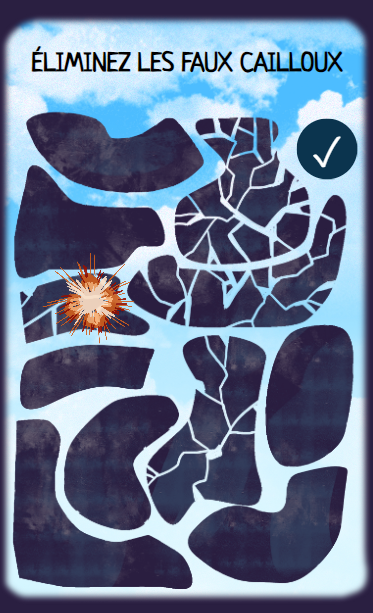
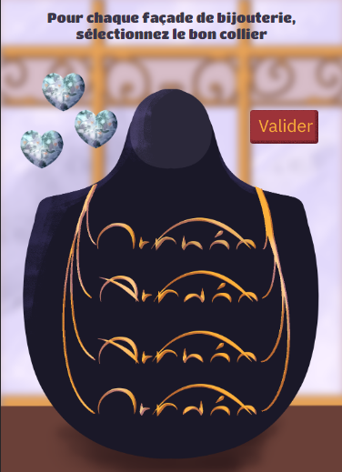

# Mon Premier Jour en tant que Développeur Web

Après avoir pris possession de mon bureau, ma première tâche était d'installer les outils nécessaires, tant pour l'entreprise que pour moi-même :

- Configuration de la base de données.
- Installation d'une application pour les réunions, les messages privés, etc.
- Mise en place de ma boîte mail.
- Préparation de l'environnement de codage.

Pour mieux comprendre ma mission et l'environnement de travail qui m'attendait, mes collègues m'ont fait tester l'un de leurs jeux.Avec tout en place, je me suis ensuite lancé dans la découverte de ma première mission, qui allait occuper les six prochaines semaines.

## Mon Initiation avec un Jeu

Mon initiation a commencé par le développement d'un jeu interactif baptisé "Pisto-Laséro". En utilisant simplement HTML, CSS et JavaScript, ainsi que les éléments graphiques fournis par la designer, j'ai créé ce jeu centré autour de la ville de Biarritz. 

L'objectif du jeu est de comparer les formes des pierres avec celles d'endroits emblématiques de Biarritz.

Dès le premier jour, j'ai été confronté à des défis. L'un d'entre eux consistait à détecter les clics de souris sur l'écran. Pour résoudre ce problème, j'ai appris à utiliser les canvas, une technique qui permet de déterminer si un pixel donné est transparent ou non. Cette approche m'a permis de détecter si un clic de souris se produisait sur une pierre, puis d'identifier laquelle en comparant les différentes couches d'images superposées. Une compétence précieuse qui m'a ouvert les portes de mon aventure en tant que développeur web.

## Poursuite du Travail sur mon premier jeu

Le deuxième jour de mon aventure en tant que développeur web a été tout aussi passionnant que le premier. J'ai repris là où je m'étais arrêté avec le développement du jeu interactif "Pisto-Laséro". Mon objectif pour cette journée était de peaufiner les fonctionnalités du jeu et d'améliorer son aspect visuel.

### Optimisation des Fonctionnalités

J'ai consacré la matinée à optimiser et peaufiné les animations. J'ai ajusté la vitesse à laquelle les éléments du jeu apparaissaient à l'écran, créant ainsi une expérience plus fluide et agréable pour les joueurs.

### Test en Conditions Réelles

L'après-midi, une opportunité passionnante s'est présentée : tester le jeu en extérieur. Nous avons choisi le jeu qui venait tout juste de voir le jour, "Le Canelé d'Or". L'équipe et moi-même voulions voir comment rendait le jeu pour savoir comment les joueurs réagiraient et recueillir des retours d'utilisateurs en direct.

En fin de journée, de retour au bureau, j'ai pris le temps de noter des commentaires et de réfléchir aux ajustements que je pourrais apporter au jeu en fonction de ces retours.

Mon deuxième jour en tant que développeur web a été une combinaison exaltante de perfectionnement du jeu et d'observation. Cela m'a donné un aperçu précieux de l'impact concret de mon travail et m'a motivé à continuer à créer une expérience exceptionnelle pour les joueurs.

## Troisième Jour : Création du Jeu "Faussaires"

Le troisième jour de mon stage a été consacré à la création d'un nouveau jeu passionnant appelé "Faussaires". Utilisant à nouveau la méthode canvas, j'ai plongé dans le développement de ce jeu unique. L'objectif du jeu était de décerner le bon logo de boutique dans la rue.
J'ai commencé par établir les mécanismes de base du jeu.

## Quatrième Jour : Améliorations et Correction de Bugs

Le quatrième jour, j'ai concentré mes efforts sur l'amélioration de mes jeux existants. Après avoir reçu des retours des joueurs et de l'équipe, j'ai identifié plusieurs bugs et zones d'amélioration dans mon premier jeu "Pisto-Laséro". J'ai passé du temps à résoudre ces problèmes, en m'assurant que le jeu fonctionnait de manière fluide et sans accrocs.

J'ai également consacré du temps à l'optimisation des performances. J'ai révisé le code pour améliorer l'efficacité et la vitesse d'exécution du jeu. Cela m'a permis de garantir une expérience utilisateur plus agréable et réactive.

En parallèle, j'ai continué à travailler sur le jeu "Faussaires", en ajoutant des détails visuels et des mécanismes de jeu plus avancés. J'ai affiné les interactions avec les logos pour rendre le jeu encore plus engageant.

Ces deux jours ont été une combinaison de créativité et de résolution de problèmes techniques. J'ai pu constater comment la prise en compte des retours des utilisateurs et la recherche de solutions ont un impact significatif sur l'expérience de jeu globale.

Ces expériences m'ont permis d'affiner mes compétences en développement, de mieux comprendre les défis de la création de jeux interactifs et d'approfondir ma maîtrise de la méthode canvas pour des projets futurs.

## Cinquième Jour : Finalisation de "Faussaires" et Traduction des Jeux

Le cinquième jour de mon stage a été marqué par la finalisation du jeu "Faussaires" et la traduction en anglais des deux premiers jeux que j'avais créés. Cette journée a été un mélange passionnant de création, de perfectionnement et de diversification de mes projets.

### Finalisation de "Faussaires"

J'ai consacré la matinée à la finalisation du jeu "Faussaires". J'ai peaufiné les derniers détails visuels, ajusté les mécanismes de jeu pour assurer une expérience fluide. J'ai également réalisé des tests approfondis pour m'assurer que le jeu fonctionnait correctement dans différentes situations.

Après plusieurs itérations et ajustements, j'ai été satisfait du résultat final de "Faussaires". Le jeu était désormais prêt à être ajouté à la collection de jeux interactifs de Digital Escapade.

### Traduction des Jeux en Anglais

L'après-midi, j'ai entrepris la traduction en anglais des deux premiers jeux que j'avais créés : "Pisto-Laséro" et "Escape the City". Cette tâche consistait à adapter les instructions, les menus et les éléments textuels des jeux pour les rendre accessibles aux joueurs anglophones.
