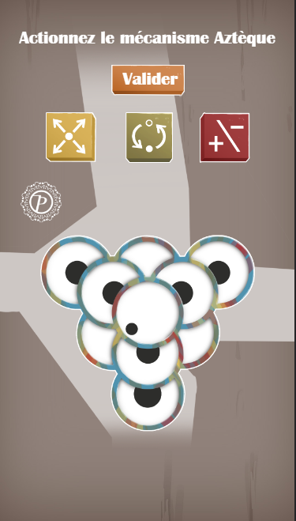
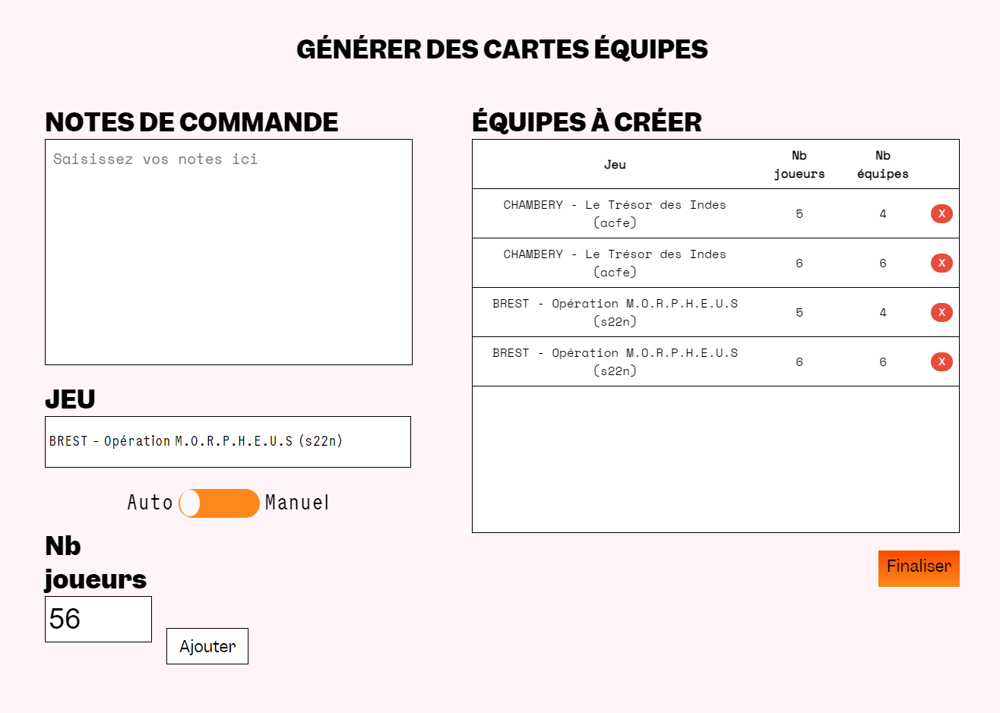
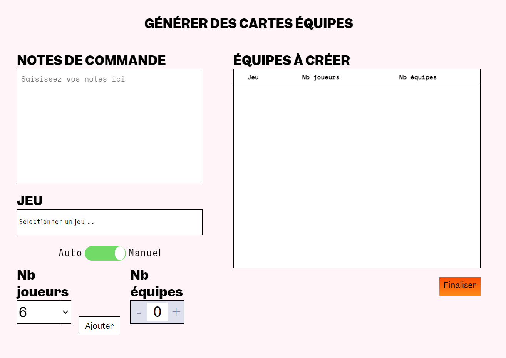
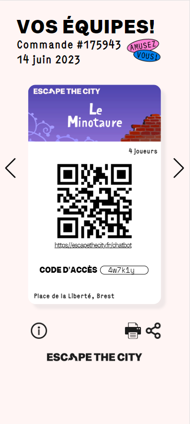
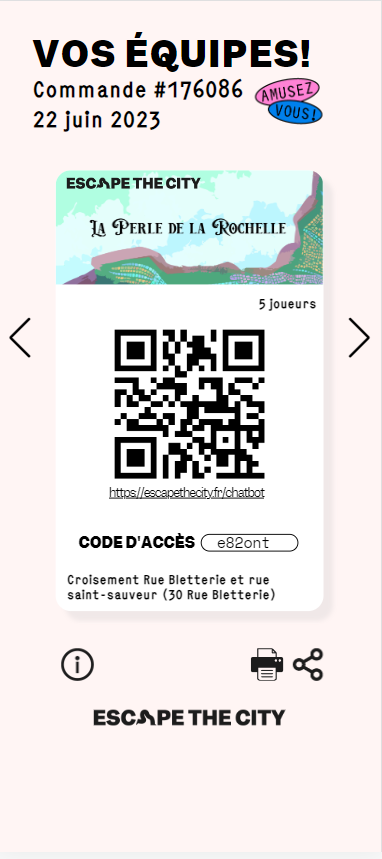

## Jour 1 : Traduction de Jeux et Début du Jeu "Le Mécanisme Aztèque"

Le premier jour de ma quatrième semaine de stage, j'ai repris le travail de traduction des jeux pour les rendre accessibles en anglais. J'ai revu les textes, les instructions et les éléments textuels afin de garantir une expérience fluide pour les joueurs anglophones.

Dans l'après-midi, j'ai entamé la création du jeu "Le Mécanisme Aztèque". Un jeu simple, où il faut trouver la bonne combinaison avec des boutons.

## Jour 2 : Finalisation du Jeu "Le Mécanisme Aztèque" et Début du Développement de la Page Web pour les Équipes

Le deuxième jour, j'ai consacré du temps à la finalisation du jeu "Le Mécanisme Aztèque". J'ai peaufiné les détails visuels, ajusté les interactions et m'assuré que le jeu était prêt à être intégré à la collection de jeux de Digital Escapade.

Par la suite, j'ai entamé un nouvel aspect de mon travail en développant une page web pour organiser les joueurs en équipes. Cette page permettrait également de générer des liens d'invitation pour les équipes participantes.

## Jour 3 : Améliorations et Débogage du Jeu Partie de Carte, Avancées sur la Page Web des Équipes

Le troisième jour, j'ai travaillé sur des améliorations et des corrections de bugs pour le jeu "Partie de Carte". J'ai identifié des points à optimiser pour assurer une expérience de jeu plus fluide et agréable pour les joueurs.

En parallèle, j'ai continué à avancer sur la page web destinée à organiser les équipes. J'ai ajouté des fonctionnalités pour faciliter la création d'équipes et la génération de liens d'invitation.

## Jour 4 : Développement de la Fonction d'Impression au Format PDF pour les Cartes d'Invitation

Le quatrième jour, j'ai été confronté au défi de mettre en place une méthode permettant d'imprimer au format PDF chaque carte d'invitation avec le lien généré pour les équipes. J'ai exploré différentes approches pour assurer que les cartes imprimées seraient esthétiques et fonctionnelles.

## Jour 5 : Corrections sur les Jeux et Finalisation du Système d'Impression des Cartes Équipes

Le cinquième jour, j'ai effectué des corrections sur les jeux existants pour m'assurer qu'ils étaient exempts de bugs et offraient une expérience optimale aux joueurs.

J'ai également consacré du temps à la finalisation du système d'impression des cartes d'équipes au format PDF. J'ai affiné les détails visuels et fonctionnels pour garantir que les cartes imprimées fourniraient toutes les informations nécessaires de manière claire et organisée.

## Conclusion de la Quatrième Semaine

La quatrième semaine de mon stage a été marquée par un travail diversifié, allant de la création de jeux à la mise en place de nouvelles fonctionnalités web. J'ai développé des jeux, avancé sur le développement de la page web pour les équipes, et résolu des défis techniques tels que l'impression au format PDF. Ces expériences m'ont permis de continuer à élargir mes compétences en développement web et en conception de jeux, tout en contribuant à l'amélioration des projets de Digital Escapade.
