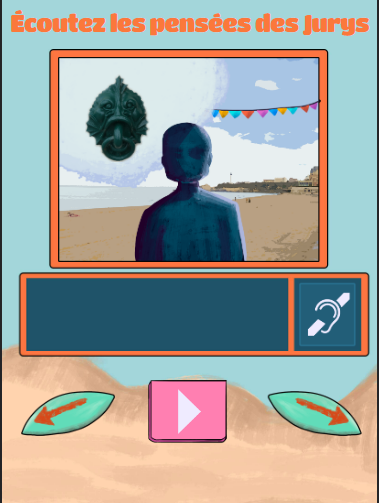
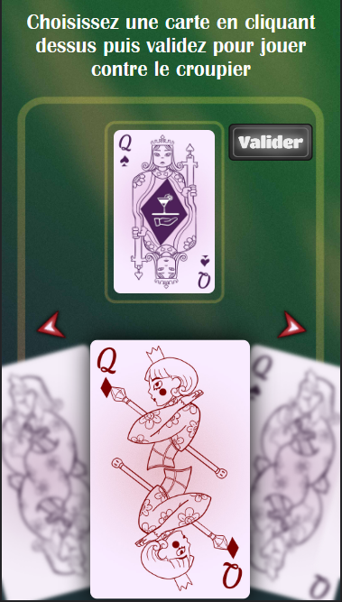

## Jour 1 : Réalisation du Jeu "Jury Surfer"

Le premier jour de ma deuxième semaine de stage a été consacré à la réalisation du jeu "Jury Surfer". Ce jeu, bien que relativement simple, a impliqué l'intégration d'un aspect audio interactif en fonction de l'image choisie par le joueur.

J'ai travaillé sur la conception des images et des éléments audio correspondants pour créer une expérience de jeu immersive. L'objectif était de permettre aux joueurs de faire des choix visuels tout en étant accompagnés d'une bande sonore adaptée. J'ai également effectué des tests pour m'assurer que les éléments audio et visuels étaient synchronisés de manière fluide.

## Jour 2 : Début du jeu : Partie de Carte

Le deuxième jour a marqué le début d'un nouveau jeu "partie de carte". J'ai commencé par la mise en place de la structure du jeu et la configuration des interactions avec les éléments du jeu. Pour ce jeu j'ai dû utilisé un slider qui permet de choisir quelles cartes je veux placer ou retirer.  

## Jour 3 : Suite du jeu et Débogage + Refonte de l'UI

Le troisième jour, j'ai poursuivi la mise en place de la webview et j'ai intégré les éléments du jeu en relation avec cette vue. J'ai également consacré du temps au débogage pour m'assurer que tous les aspects de la webview fonctionnaient correctement. En parallèle, j'ai entrepris une refonte de l'interface utilisateur (UI) pour améliorer l'expérience visuelle des joueurs.

## Jour 4 : Finalisation du jeu et Traduction en Anglais

Le quatrième jour a été dédié à la finalisation de la webview partie de carte. J'ai peaufiné les interactions, optimisé les performances et m'assuré que tous les éléments fonctionnaient harmonieusement. Ensuite, j'ai entrepris la traduction de ce nouveau jeu en anglais, ce qui a impliqué de revoir les textes, les instructions et les éléments textuels pour une expérience multilingue cohérente.

## Conclusion de la Deuxième Semaine

La deuxième semaine de mon stage a été riche en création, en intégration et en optimisation. J'ai pu travailler sur une variété de projets, de la réalisation du jeu "Jury Surfer" à la mise en place d'une webview interactive. Ces expériences m'ont permis d'élargir mes compétences en développement web et en conception de jeux, tout en contribuant à l'enrichissement de la collection de jeux de Digital Escapade.
