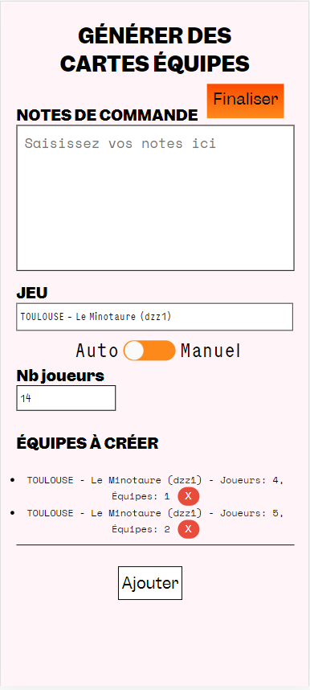
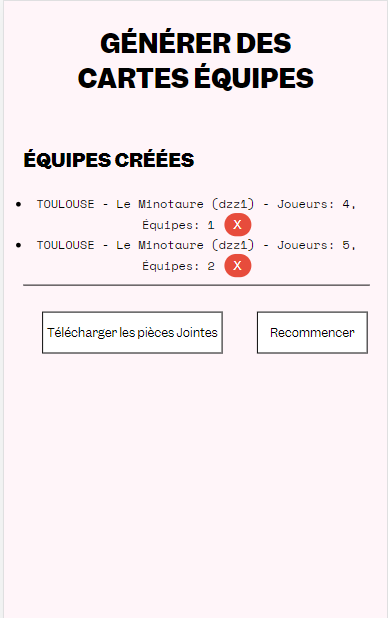
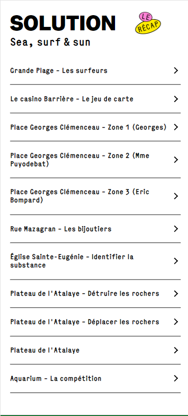
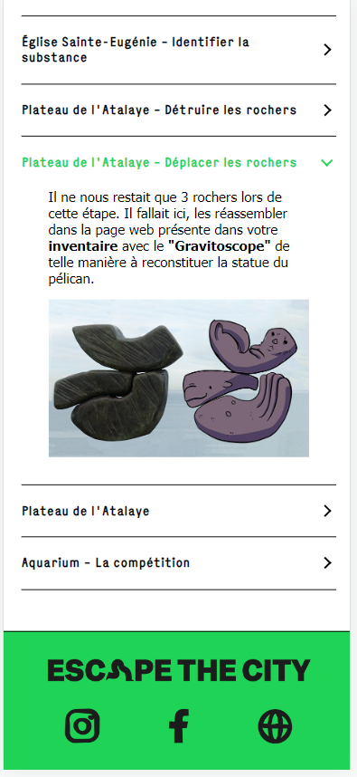
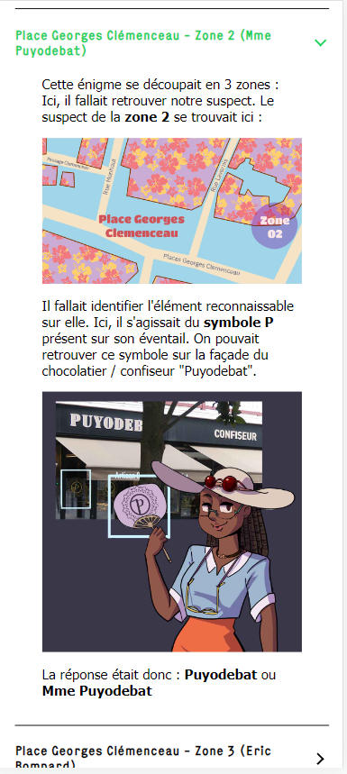

## Jour 1 : Adaptation au Format Mobile de la Page de Création d'Équipes

La sixième et dernière semaine de mon stage a débuté en adaptant la page de création d'équipes au format mobile. L'objectif était d'optimiser l'expérience utilisateur en réorganisant les éléments visuels et en ajustant les mises en page pour permettre de créer facilement des équipes depuis leurs appareils mobiles.

## Jour 2 : Mise en Place d'une Page Web Référençant les Solutions des Jeux

Le deuxième jour a été consacré à la création d'une page web répertoriant toutes les solutions disponibles pour les jeux. L'objectif était de créer une interface conviviale et facile à naviguer, permettant de trouver rapidement les réponses et les solutions aux défis des jeux.

## Jour 3 : Développement Continu de la Page Web des Solutions

Poursuivant le développement de la page web des solutions, j'ai ajouté des fonctionnalités pour simplifier la recherche et la sélection des jeux. J'ai également veillé à présenter les solutions de manière claire et organisée.

## Jour 4 : Finalisation du HTML/CSS de la Page Web des Solutions et Création d'un Endpoint Python

Le quatrième jour, j'ai apporté les dernières touches au HTML et au CSS de la page web des solutions, en m'assurant que le design soit cohérent, attrayant et convivial pour les utilisateurs.

En parallèle, un endpoint en Python a été mis en place. Son but était de permettre la récupération de toutes les données d'un jeu sélectionné via un lien spécifique. Cette fonctionnalité devait simplifier l'accès aux solutions.

## Jour 5 : Finalisation du Endpoint et Achèvement de la Page Web des Solutions

Le cinquième jour, les efforts ont été concentrés sur la finalisation du endpoint créé. Des tests approfondis ont été réalisés pour garantir que les données étaient correctement récupérées et affichées en fonction du jeu sélectionné.

En même temps, la page web des solutions a été finalisée dans son ensemble. Les dernières vérifications ont été effectuées pour s'assurer que tout fonctionnait correctement et que les joueurs pouvaient facilement accéder aux réponses dont ils avaient besoin.

## Conclusion de la Sixième Semaine et du Stage

La sixième et dernière semaine de mon stage a été marquée par l'optimisation de l'expérience utilisateur et la création de ressources utiles pour les joueurs. L'adaptation de la page de création d'équipes pour les appareils mobiles, le développement d'une page web référençant les solutions des jeux et la mise en place d'un endpoint en Python ont tous contribué à améliorer l'expérience des joueurs et la qualité des produits de Digital Escapade. Mon stage se termine positivement, avec l'acquisition de nouvelles compétences et la réussite de projets significatifs.
