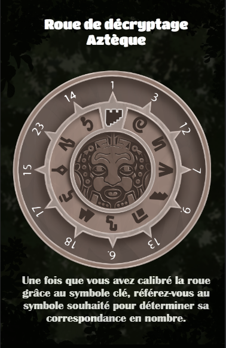
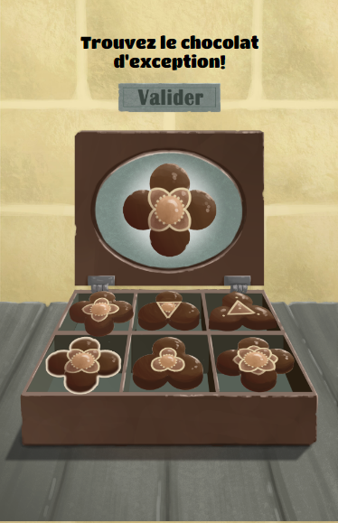
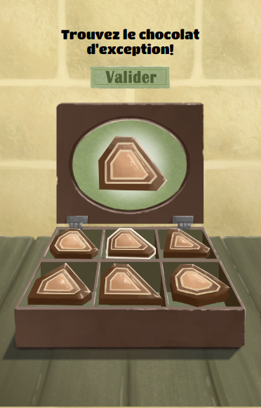
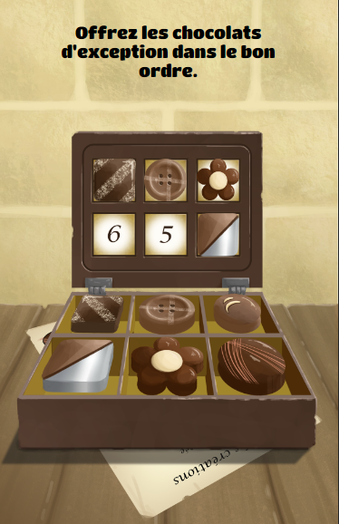

## Jour 1 : Réalisation du Jeu "Le Secret de Biraben"

Le premier jour de ma troisième semaine de stage a été consacré à la réalisation du jeu "Le Secret de Biraben". J'ai travaillé sur la conception et la mise en place de ce jeu, en développant des mécanismes et des éléments visuels uniques pour créer une expérience immersive et engageante.
Le concept de ce jeu est une roue avec des symboles qui faut tourner pour reconstruire une phrase.

## Jour 2 : Débogage et Finalisation du Jeu "Le Secret de Biraben" + Début du Jeu "Les Faveurs 01"

Le deuxième jour, j'ai effectué des tests approfondis et résolu les éventuels problèmes pour finaliser le jeu "Le Secret de Biraben". J'ai peaufiné les détails visuels, ajusté les interactions et m'assuré que le jeu fonctionnait sans accrocs.

Dans l'après-midi, j'ai commencé le développement du jeu "Les Faveurs 01". J'ai établi les bases du jeu, en travaillant sur les mécanismes et les éléments nécessaires pour offrir une expérience captivante.

## Jour 3 : Débogage du Jeu "Les Faveurs 01" et Réalisation des Jeux "Les Faveurs 02 et 03"

Le troisième jour, j'ai consacré du temps au débogage du jeu "Les Faveurs 01". J'ai identifié et résolu les problèmes potentiels pour m'assurer que le jeu fonctionnait de manière fluide et conforme aux attentes.

Par la suite, j'ai entamé la réalisation des jeux "Les Faveurs 02 et 03". J'ai travaillé sur la conception des mécanismes spécifiques à chaque jeu, en veillant à apporter des variations intéressantes à la collection de jeux de Digital Escapade.

## Jour 4 : Utilisation de l'Application Jira, Traduction en Anglais des Jeux Existants

Le quatrième jour, j'ai travaillé sur l'utilisation de l'application Jira pour la gestion de projet. J'ai exploré les fonctionnalités de l'application, notamment la création de tâches, l'attribution de priorités et le suivi des avancements.

J'ai également poursuivi la traduction en anglais des jeux déjà existants. J'ai adapté les éléments textuels pour offrir une expérience multilingue et accessible à un public international.

## Jour 5 : Suite des Traductions et Correction de Bugs sur les Jeux Partie de Carte et "Le Secret de Biraben"

Le cinquième jour, j'ai continué la traduction en anglais des jeux restants. J'ai apporté des ajustements pour m'assurer que les instructions, les menus et les textes étaient cohérents et précis dans les deux langues.

En parallèle, j'ai travaillé sur la correction de bugs identifiés dans les jeux "Partie de Carte" et "Le Secret de Biraben". J'ai pris le temps de résoudre ces problèmes pour garantir une expérience fluide et sans accrocs pour les joueurs.
